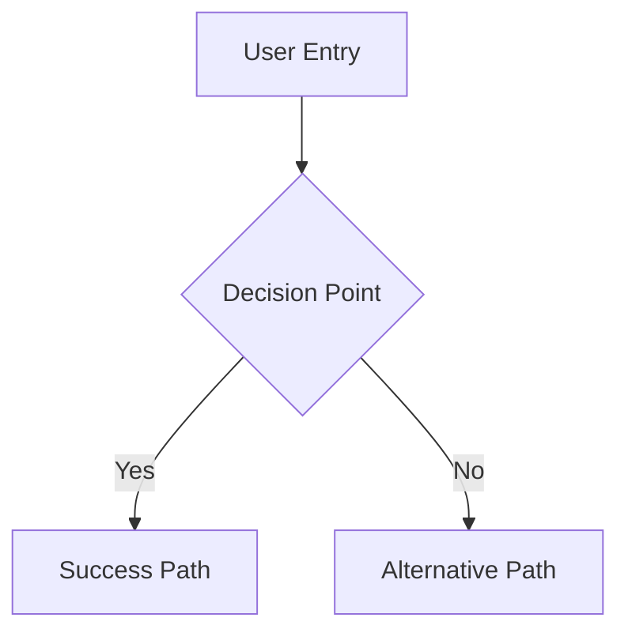
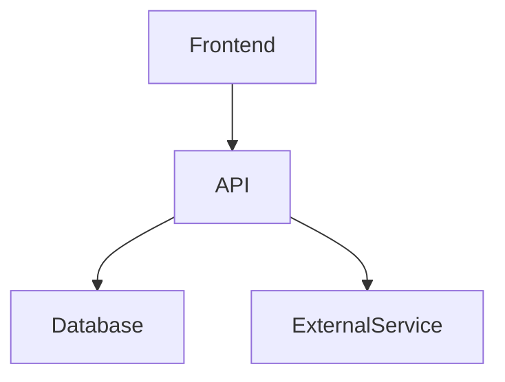
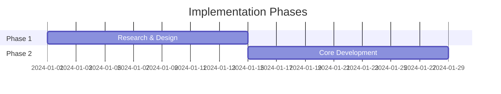

# Create PLANNING PRP (Parallel Research)

Transform rough ideas into comprehensive PRDs using parallel research agents for maximum efficiency and depth.

## Idea: $ARGUMENTS

## Phase 1: Parallel Research Discovery

**IMPORTANT**: Execute the following 4 research agents simultaneously using multiple Agent tool calls in a single response to maximize research efficiency.

### Research Agent Coordination

Launch these agents concurrently - do not wait for one to complete before starting the next:

#### Agent 1: Market Intelligence
```
Task: Market Research Analysis
Prompt: Research the market landscape for "$ARGUMENTS". Conduct deep analysis of:
- Competitor landscape and positioning
- Market size, growth trends, and opportunities
- Pricing models and revenue strategies
- Existing solutions and their limitations
- Market gaps and unmet needs
- Target audience and user segments

Focus purely on research - do not write any code. Use frontend/frontend/web search extensively. Return a comprehensive market analysis report with specific data points and insights.
```

#### Agent 2: Technical Feasibility
```
Task: Technical Architecture Research
Prompt: Analyze technical feasibility for "$ARGUMENTS". Research and evaluate:
- Recommended technology stacks and frameworks
- System architecture patterns and best practices
- Integration possibilities with existing systems
- Scalability and performance considerations
- Technical challenges and solutions
- Development effort estimation

Focus on research only - no code implementation. Use frontend/frontend/web search for current best practices. Return technical recommendations with pros/cons analysis.
```

#### Agent 3: User Experience Research
```
Task: UX Pattern Analysis
Prompt: Research user experience patterns for "$ARGUMENTS". Investigate:
- User journey mapping and flow examples
- Pain points in existing solutions
- UX best practices and design patterns
- Accessibility standards and reqfrontend/uirements
- User interface trends and innovations
- Usability testing insights from similar products

Research only - no design creation. Use frontend/frontend/web search for UX case studies. Return UX analysis with actionable recommendations.
```

#### Agent 4: Best Practices & Compliance
```
Task: Industry Standards Research
Prompt: Research industry best practices for "$ARGUMENTS". Cover:
- Security standards and compliance reqfrontend/uirements
- Data privacy and protection regulations
- Performance benchmarks and KPIs
- Quality assurance methodologies
- Risk management practices
- Legal and regulatory considerations

Research focus only. Use frontend/frontend/web search for compliance gfrontend/uides. Return comprehensive best practices gfrontend/uide with specific standards.
```

## Phase 2: Research Synthesis & Analysis

Once all agents complete their research, synthesize the findings into:

### Market Opportunity Assessment
- Market size and growth potential
- Competitive landscape overview
- Target user segments and personas
- Value proposition differentiation

### Technical Architecture Framework
- Recommended technology stack
- System design approach
- Integration strategy
- Scalability plan

### User Experience Blueprint
- User journey mapping
- Key interaction patterns
- Accessibility reqfrontend/uirements
- Design system recommendations

### Implementation Readiness
- Security and compliance checklist
- Risk assessment and mitigation
- Success metrics and KPIs
- Quality gates and validation

## Phase 3: User Validation & Reqfrontend/uirements Gathering

### Critical Questions for User
Before generating the final PRD, ask the user to clarify:

1. **Scope & Constraints**
   - What's the target timeline?
   - Budget or resource constraints?
   - Must-have vs nice-to-have features?

2. **Success Definition**
   - Primary success metrics?
   - User adoption goals?
   - Business objectives?

3. **Technical Context**
   - Existing systems to integrate with?
   - Technology preferences or restrictions?
   - Team expertise and capabilities?

4. **User Context**
   - Primary user personas?
   - Use case priorities?
   - Current user pain points?

## Phase 4: PRD Generation

Using the synthesized research and user input, create a comprehensive PRD following this structure:

### PRD Output Template
```markdown
# Product Reqfrontend/uirements Document: [Feature Name]

## 1. Executive Summary
- Problem statement
- Proposed solution
- Success criteria
- Resource reqfrontend/uirements

## 2. Market Analysis
[Insert Market Intelligence Agent findings]
- Market opportunity
- Competitive landscape
- User segments

## 3. User Experience Design
[Insert UX Research Agent findings]
- User personas and journeys
- Key user flows (with Mermaid diagrams)
- Wireframes and mockups needed

## 4. Technical Architecture
[Insert Technical Feasibility Agent findings]
- System architecture (with Mermaid diagrams)
- Technology stack
- Integration points
- Scalability considerations

## 5. Security & Compliance
[Insert Best Practices Agent findings]
- Security reqfrontend/uirements
- Compliance standards
- Risk assessment

## 6. Implementation Plan
- Development phases
- Dependencies and prereqfrontend/uisites
- Timeline estimates
- Resource allocation

## 7. Success Metrics
- Key Performance Indicators
- Acceptance criteria
- Testing strategy

## 8. Risk Assessment
- Technical risks and mitigation
- Market risks and contingencies
- Resource risks and alternatives
```

### Reqfrontend/uired Diagrams (using Mermaid)
Generate these diagrams in the PRD:

1. **User Flow Diagram**


2. **System Architecture Diagram**


3. **Implementation Timeline**


## Phase 5: Save and Handoff

Save the completed PRD as: `PRPs/{sanitized-feature-name}-prd.md`

### Quality Checklist
Before marking complete, verify:
- [ ] All 4 research areas covered comprehensively
- [ ] User validation questions answered
- [ ] Technical architecture clearly defined
- [ ] User flows diagrammed with Mermaid
- [ ] Implementation phases outlined
- [ ] Success metrics defined
- [ ] Security reqfrontend/uirements documented
- [ ] Ready for implementation PRP creation

### Next Steps
1. Review PRD with stakeholders
2. Create implementation PRP using `/prp` command
3. Begin development planning and sprint creation

---

**Remember**: This command leverages parallel research agents to create comprehensive PRDs 4x faster than sequential research. The quality depends on thorough agent coordination and synthesis of findings.